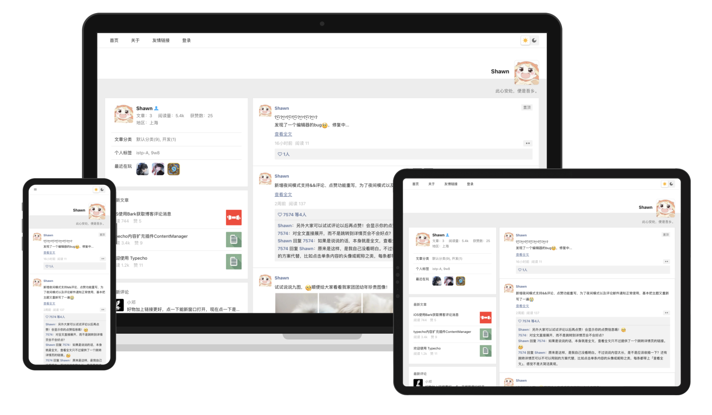

# Typecho仿微信主题reborn
重回博客后的第一个主题，鸣谢[@泽泽](https://typecho.work/ "泽泽")

## 主题预览
预览链接：[Shawn](https://shawnzeng.com)

## 主题特性
- 支持文章、说说两种内容形式：首页部分，说说以内容试行展示，文章则以朋友圈分享内容的形式展示；详情页部分，说说以朋友圈内容形式展示，文章则以公众号文章形式展示
- 内容点赞：文章、说说、评论均支持点赞，同时若用户在站点存在评论缓存数据，会记录该用户的点赞信息，展示为点赞清单
- 深色模式支持：深浅模式一键丝滑切换，默认模式为跟随当前用户系统深浅模式，同时切换后使用`sessionStorage`进行存储，关闭浏览器后销毁
- `markdown编辑器`接入，主题自带`markdown编辑器`，使用了开源的[Editor.md](https://pandao.github.io/editor.md/ "Editor.md")编辑器
- 支持说说九图，并添加灯箱支持
- 代码高亮，同时支持深浅模式切换、收缩&展开、一键复制
- 评论表情包，接入微信、bilibili表情包，暂时没放太多其它的因为感觉好像没啥必要~
- 文章内容支持回复可见
- 根据文章内容标题自动生成文章目录
- 主题个性化配置：为了提高大家的个性化，主题提供了多项自定义配置供大家使用

## 捐赠
开源不易，请我喝杯🧋？

|  |  |
|---|---|

